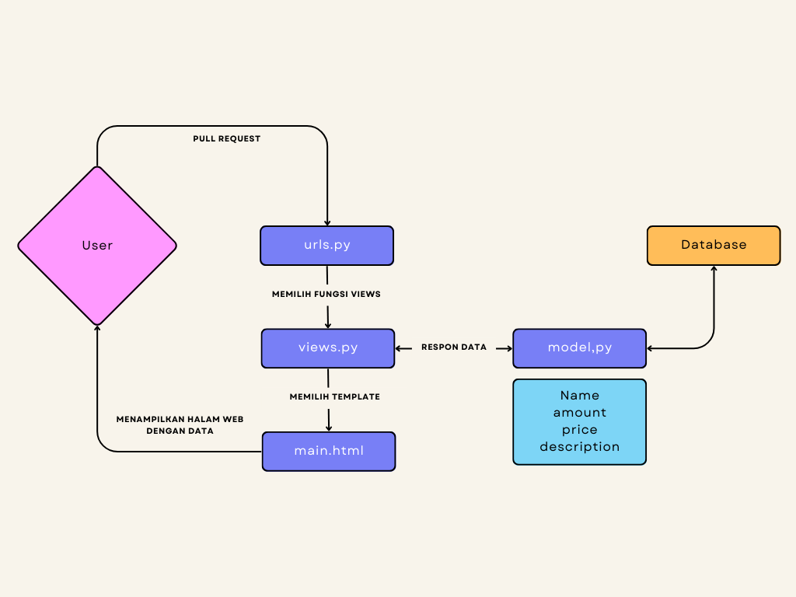
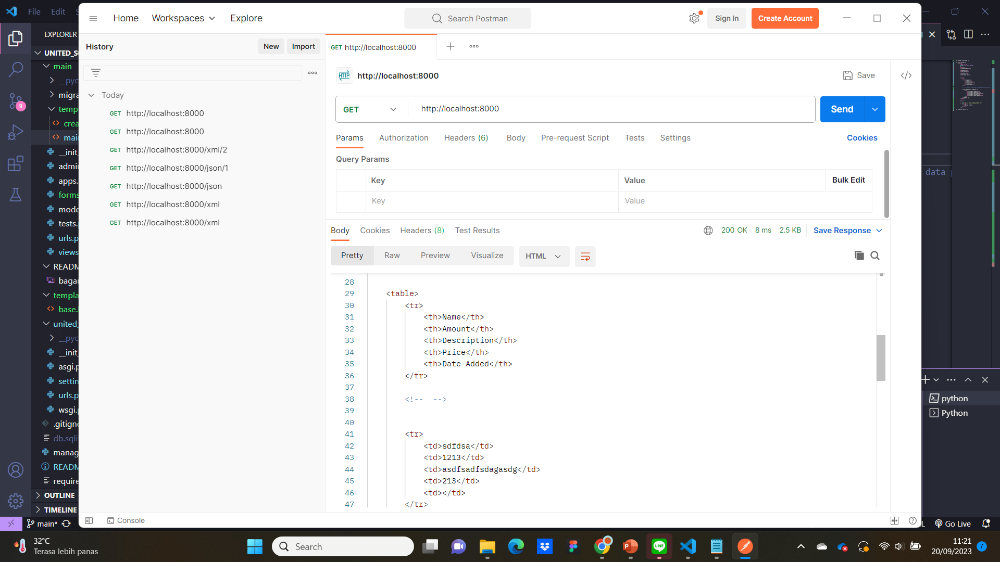
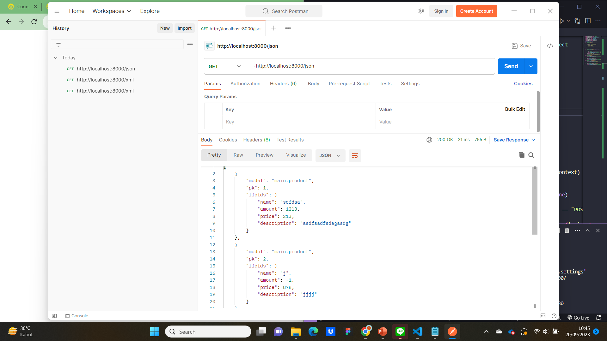
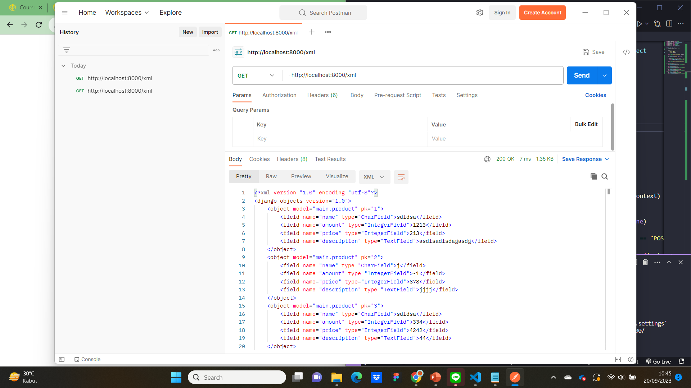
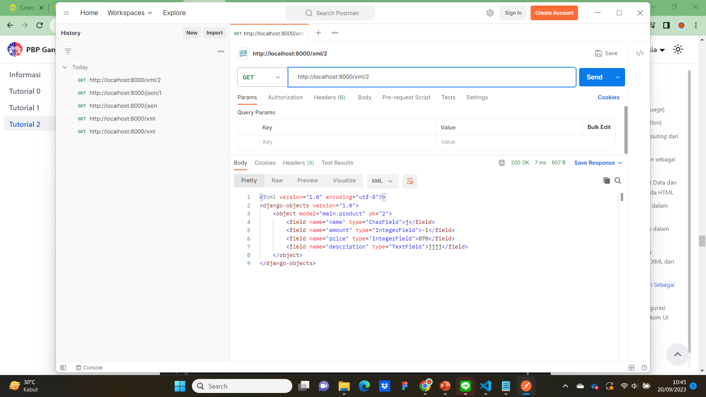
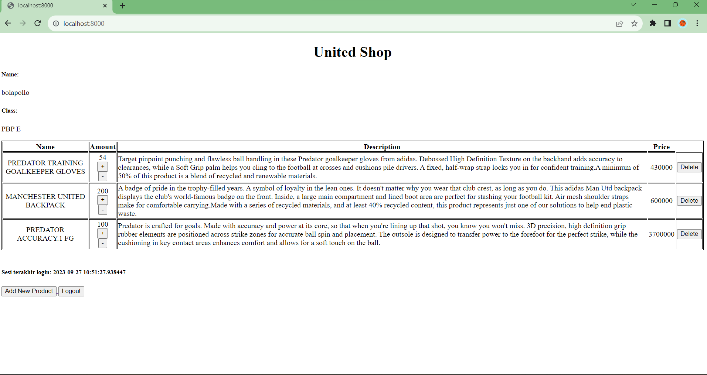
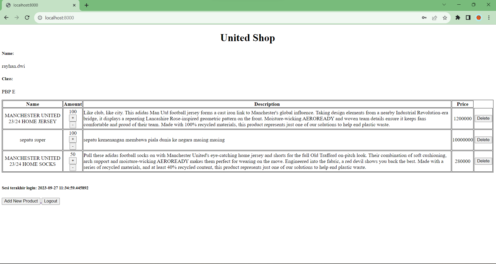

# Tugas 2
## 1. Jelaskan bagaimana cara kamu mengimplementasikan checklist di atas secara step-by-step (bukan hanya sekadar mengikuti tutorial).
### Membuat sebuah proyek Django baru.
pada direktori baru yang telah saya buat, saya membuat proyek Django baru "united_squad" dengan cara membuka terminal di direktori tersebut dan menulis kode ini.
~~~  
django-admin startproject united_squad
~~~  
### Membuat aplikasi dengan nama main pada proyek tersebut.
pada direktori proyek united_squad, saya membuat aplikasi main dengan menjalankan kode
~~~
python manage.py startapp main
~~~
### Melakukan routing pada proyek agar dapat menjalankan aplikasi main
setelah aplikasi ada, saya mendaftarkan aplikasi main ke dalam `settings.py`
~~~
INSTALLED_APPS = [
    'main',
    'django.contrib.admin',
    'django.contrib.auth',
    'django.contrib.contenttypes',
    'django.contrib.sessions',
    'django.contrib.messages',
    'django.contrib.staticfiles',
]
~~~
### Membuat model pada aplikasi `main` dengan nama `Product` dan memiliki atribut wajib sebagai berikut.
- `name` tipe `Charfield`
untuk nama dari model
- `amount` tipe `IntegerField`
untuk jumlah yang tesisa dari model
- `price` tipe `IntegerField`
untuk harga dari model
- `description` tipe `TextField`
untuk mendeskripsikan model

setelah itu saya akan migrasi untuk menyimpan model pada database
~~~
python manage.py makemigrations
python manage.py migrate
~~~
### Membuat sebuah fungsi `show_main` pada `views.py` untuk dikembalikan ke dalam sebuah template HTML
saya membuat fungsi `show_main` yang menyimpan data untuk `main.html`
~~~
from django.shortcuts import render

# Create your views here.
def show_main(request):
    context = {
        'name': 'Rayhan Dwi Sakha',
        'class': 'PBP E',
        'product': 'MANCHESTER UNITED LIFESTYLER THIRD JERSEY',
        'amount' : 25,
        'description' : "Taking Manchester United's beautiful game off the pitch. A super-wearable iteration of the club's third kit shirt, this lifestyler football jersey replaces performance features with premium engineered fabric that's soft to the touch and comfortable flat-knit details. The absence of a sponsor logo and that tonal adidas Badge of Sport ensure that all-important red devil crest takes even more of the spotlight. A minimum of 70% of this product is a blend of recycled and renewable materials.",
        'price' : 1400000
    }

    return render(request, "main.html", context)
~~~

### Membuat sebuah routing pada `urls.py` aplikasi `main` untuk memetakan fungsi yang telah dibuat pada `views.py`.
saya membuat routing untuk memetakan fungsi pada `views.py` dengan kode ini
~~~
from django.urls import path
from main.views import show_main

app_name = 'main'

urlpatterns = [
    path('', show_main, name='show_main'),
]
~~~

## 2. Buatlah bagan yang berisi request client ke web aplikasi berbasis Django beserta responnya dan jelaskan pada bagan tersebut kaitan antara urls.py, views.py, models.py, dan berkas html.

1. **urls.py**  
 Saat User melakukan pull request kepada website, request akan dikirim kepada fungsi yang sesuai pada halaman tersebut yang terdapat pada urlpatterns halaman tersebut. Pada halaman utama website ini, disambungkan dengan fungsi `show_main` yang berada pada `views.py`,
2. **views.py**
 Pada `views.py` terdapat fungsi `show_main` yang memiliki parameter `request` yang akan menerima request dari User. Pada fungsi tersebut, terdapat `context` yang merupakan dictionary untuk memberikan data pada `main.html` pada bagian return fungsi tersebut. Fungsi tersebut memilih `main.html` untuk mengirim data yang didapat dari database untuk ditampilkan nanti ke User.
3. **models.py**
 Semua bentuk model yang digunakan pada aplikasi dibuat dengan bentuk class pada file tersebut. Pada aplikasi main ini, dibuat sebuah model Product yang memiliki beberapa atribut. Pada `views.py`, dibuat berbagai object Product yang akan dikirim ke `main.html`.
4. **main.html**
  Data yang diterima dari `views.py` akan ditampilkan pada file html ini dan dapat dilihat oleh User.

## 3. Jelaskan mengapa kita menggunakan virtual environment? Apakah kita tetap dapat membuat aplikasi web berbasis Django tanpa menggunakan virtual environment?
dengan menggunakan virtual environment, kita dapat mengembangkan suatu proyek yang mungkin membutuhkan suatu versi terpisah tanpa mempengaruhi proyek lain atau instalasi python global. Hal ini juga bisa menghindari konflik dan keamanan proyek terjaga karena virtual environment bisa memisahkan kebutuhan proyek-proyek yang berbeda dengan mengisolasi dependensi spesifik yang dibutuhkan suatu proyek ke dalam lingkungan tersebut

Kita bisa membuat aplikasi web berbasis Django tanpa menggunakan  virtual environment. Tapi, seperti yang sudah dijelaskan sebelumnya. Jika kita tidak menggunaan virtual environment, maka akan menimbulkan risiko konflik dan masalah dependensi jika Anda bekerja pada lebih dari satu proyek atau ingin menggunakan dependensi spesifik.

## 4. Jelaskan apakah itu MVC, MVT, MVVM dan perbedaan dari ketiganya.
MVC, MVT, dan MVVM adalah pola desain yang digunakan dalam pengembangan perangkat lunak, khususnya dalam pengembangan aplikasi berbasis web dan mobile. Masing-masing pola ini memiliki tujuan dan konsep yang berbeda, meskipun mereka semua berusaha untuk memisahkan logika bisnis dari tampilan (UI) agar aplikasi lebih mudah dipahami, dikembangkan, dan dipelihara.

1. **MVC (Model-View-Controller)**:
   - **Model**: Menangani logika bisnis dan manipulasi data. Model ini mencakup pemodelan objek dan aturan bisnis aplikasi.
   - **View**: Bertanggung jawab untuk menampilkan data ke pengguna dan menerima masukan pengguna. Ini adalah bagian tampilan (UI) dari aplikasi.
   - **Controller**: Mengendalikan alur aplikasi dan menangani permintaan pengguna. Ini menghubungkan Model dan View, menerima masukan dari View, dan memutuskan tindakan apa yang harus diambil.

   Perbedaan utama MVC dengan MVT dan MVVM adalah bahwa MVC digunakan terutama dalam pengembangan perangkat lunak berbasis desktop dan aplikasi web tradisional. MVC biasanya digunakan dalam bahasa pemrograman seperti Java, C#, dan Ruby on Rails.

2. **MVT (Model-View-Template)**:
   - **Model**: Mirip dengan Model dalam MVC, menangani logika bisnis dan pemodelan data.
   - **View**: Menangani tampilan (UI) dan menampilkan data ke pengguna. Ini berfokus pada bagian tampilan aplikasi.
   - **Template**: Bertanggung jawab untuk tampilan halaman web dan bagaimana data disajikan dalam HTML. Template adalah bagian yang memisahkan tampilan dari logika aplikasi.

   MVT adalah pola desain yang umumnya digunakan dalam kerangka kerja web Django, yang menggunakan pendekatan yang lebih spesifik untuk pengembangan aplikasi web. Ini membedakan antara View dan Template, sehingga memudahkan pemisahan logika tampilan dan tampilan HTML.

3. **MVVM (Model-View-ViewModel)**:
   - **Model**: Mirip dengan Model dalam MVC dan MVT, menangani logika bisnis dan pemodelan data.
   - **View**: Bertanggung jawab untuk menampilkan data ke pengguna, tetapi dalam MVVM, View lebih pasif dan tidak memiliki logika bisnis yang signifikan.
   - **ViewModel**: Menyediakan lapisan abstraksi antara Model dan View. Ini mengubah data dari Model ke format yang dapat ditampilkan oleh View dan juga menangani interaksi pengguna dan perubahan data.

   MVVM adalah pola desain yang sering digunakan dalam pengembangan aplikasi berbasis mobile dengan kerangka kerja seperti Angular, Vue.js, dan beberapa platform mobile seperti Flutter.

Perbedaan utama antara ketiganya adalah dalam cara mereka mengatur dan mengelola tampilan (UI) dalam aplikasi. MVC lebih umum digunakan dalam pengembangan perangkat lunak desktop, MVT adalah pendekatan yang digunakan dalam kerangka kerja web Django, sedangkan MVVM adalah pendekatan yang umum digunakan dalam pengembangan aplikasi berbasis mobile.

# Tugas 3
## 1. Apa perbedaan antara form POST dan form GET dalam Django?
POST dan GET merupakan dua metode berbeda untuk mengirim sebuah data dari form HTML ke server
POST:
* data form dikirimkan sebagai bagian dari permintaan HTTP yang tidka terlihat user
* digunakan ketika ingin mengirim data yang mungkin akan memengaruhi server.
* gunakan metode ini jika ingin mengirim data yang sensitif
GET:
* data form ditambahkan ke URL sebagai parameter query string yang terlihat user
* digunakan ketika ingin mengambil atau mencari informasi dari server
* gunakan metode ini untuk operasi read-only atau ingin memungkinkan user dengan mudah membagikan hasilnya.

## 2. Apa perbedaan utama antara XML, JSON, dan HTML dalam konteks pengiriman data?
* XML dirancang untuk menyimapan dan mengirim data struktural. XML adalah format yang sangat fleksibel dan kuat untuk mendefinisikan struktur data yang kompleks. Biasanya digunakan dalam berbagai konteks, termasuk pertukaran data antara sistem yang berbeda, konfigurasi file, dan penyimpanan data
* JSON dirancang untuk pertukaran data ringan dan mudah dibaca antara aplikasi berbasis web. JSON dapat mewakili struktur data sederhana atau kompleks, tapi tidak sefleksibel XML dalam hal definisi struktur data. Digunakan dalamkonteks pertukaran data di web
* HTML dirancang untuk mendefinisikan struktur dan presentasi dokumen web. Karena fokus utamanya bukan data, HTML tidak sefleksibel dalam hal definisi struktur data seperti XML atau JSON. Digunakan untuk membaut halaman web yang dapat diakses oleh browser web. tidak umum digunakan untuk tujuan pertukuran data murni

## 3. Mengapa JSON sering digunakan dalam pertukaran data antara aplikasi web modern?
Seperti yang sudah dijelaskan sebelumnya. JSON (JavaScript Object Notation) memiliki format pertukaran data yang sangat ringan serta lebih mudah dibaca dan ditulis oleh manusia. JSON memiliki ukuran file yang lebih kecil dan transmisi data yang lebih cepat. JSON juga dapat diurai dengan fungsi JavaScript standar.

## 4. Jelaskan bagaimana cara kamu mengimplementasikan checklist di atas secara step-by-step.
### Membuat input form untuk menambahkan objek model pada app sebelumnya.
*Membuat `base.html` yang digunakan sebagai template untuk templates html yang ada
~~~

<!DOCTYPE html>
<html lang="en">
    <head>
        <meta charset="UTF-8" />
        <meta
            name="viewport"
            content="width=device-width, initial-scale=1.0"
        />
        
        
    </head>

    <body>
        
        
    </body>
</html>
~~~
*Mengedit `TEMPLATES` pada `settings.py` agar `base.html` terdeteksi
~~~
...
TEMPLATES = [
    {
        'BACKEND': 'django.template.backends.django.DjangoTemplates',
        'DIRS': [BASE_DIR / 'templates'],
        'APP_DIRS': True,
        ...
~~~
*mengedit `main.html` untuk meng-extend dari `base.html`
~~~

...
~~~
*membuat file `forms.py` untuk membuat form input dan mengimportnya ke file `views.py`
~~~
from django.forms import ModelForm
from main.models import Product

class ProductForm(ModelForm):
    class Meta:
        model = Product
        fields = ["name", "amount", "description", "price"]
~~~
properti dari form yang dibuat bia didapatkan dengan mengimport `ModelForm`. class `ProductForm` yang dibuat akan menginherit `ModelForm` dan memberikan properti `model` dan memanbahkan field pada properti model
*Membuat fungsi `create_product` untuk menambahkan data produk secara otomatis
~~~
def create_product(request):
    form = ProductForm(request.POST or None)

    if form.is_valid() and request.method == "POST":
        form.save()
        return HttpResponseRedirect(reverse('main:show_main'))

    context = {'form': form}
    return render(request, "create_product.html", context)
~~~
*Mengubah fungsi `show_main` supaya data bisa diakses pada `main.html`
~~~
def show_main(request):
    products = Product.objects.all()
    
    context = {
        'name': 'Rayhan Dwi Sakha',
        'class': 'PBP E',
        'product': products
    }

    return render(request, "main.html", context)
~~~
*Membuat `create_product.html` untuk menambahkan objek baru.
~~~
 


<h1>Add New Product</h1>

<form method="POST">
    
    <table>
        {{ form.as_table }}
        <tr>
            <td></td>
            <td>
                <input type="submit" value="Add Product"/>
            </td>
        </tr>
    </table>
</form>


~~~
### Tambahkan 5 fungsi views untuk melihat objek yang sudah ditambahkan dalam format HTML, XML, JSON, XML by ID, dan JSON by ID.
* fungsi `show_main` format HTML
~~~
def show_main(request):
    products = Product.objects.all()
    
    context = {
        'name': 'Rayhan Dwi Sakha',
        'class': 'PBP E',
        'product': products
    }

    return render(request, "main.html", context)
~~~
* fungsi `show_xml`
~~~
def show_xml(request):
    data = Product.objects.all()
    return HttpResponse(serializers.serialize("xml", data), content_type="application/xml")
~~~
* fungsi `show_json`
~~~
def show_json(request):
    data = Product.objects.all()
    return HttpResponse(serializers.serialize("json", data), content_type="application/json")
~~~
* fungsi `show_xml_by_id`
~~~
def show_xml_by_id(request, id):
    data = Product.objects.filter(pk=id)
    return HttpResponse(serializers.serialize("xml", data), content_type="application/xml")
~~~
* fungsi `show_json_by_id`
~~~
def show_json_by_id(request, id):
    data = Product.objects.filter(pk=id)
    return HttpResponse(serializers.serialize("json", data), content_type="application/json")
~~~

menambahkan url untuk kelima fungsi agar dapat diakses sesuai dengan url nya masing-masing
~~~
from django.urls import path
from main.views import show_main, create_product, show_xml, show_json, show_xml_by_id, show_json_by_id

app_name = 'main'

urlpatterns = [
    path('', show_main, name='show_main'),
    path('create-product', create_product, name='create_product'),
    path('xml/', show_xml, name='show_xml'),
    path('json/', show_json, name='show_json'), 
    path('xml/<int:id>/', show_xml_by_id, name='show_xml_by_id'),
path('json/<int:id>/', show_json_by_id, name='show_json_by_id'),
]
~~~
### Mengakses kelima URL di poin 2 menggunakan Postman, membuat screenshot dari hasil akses URL pada Postman, dan menambahkannya ke dalam README.md.
* HTML

* JSON

* XML

* JSON by id

* XML by id

# Tugas 3
## 1. Apa itu Django UserCreationForm, dan jelaskan apa kelebihan dan kekurangannya?
UserCreationForm adalah impor formulir bawaan yang memudahkan pembuatan formulir pendaftaran pengguna dalam aplikasi web. Dengan formulir ini, pengguna baru dapat mendaftar dengan mudah di situs web Anda tanpa harus menulis kode dari awal
Kelebihan:
* Mudah digunakan dan diimplementasikan.
* Sudah terintegrasi dengan Django's authentication system, sehingga memudahkan pengelolaan pengguna.
* Memiliki validasi bawaan yang membantu memastikan bahwa input yang diberikan sesuai dengan persyaratan.
Kekurangan:
* Desain formulir ini mungkin tidak sesuai dengan kebutuhan khusus suatu proyek, dan mungkin memerlukan penyesuaian tambahan.
* Formulir ini hanya cocok untuk skenario autentikasi yang sederhana
## 2. Apa perbedaan antara autentikasi dan otorisasi dalam konteks Django, dan mengapa keduanya penting?
* Autentikasi adalah proses verifikasi identitas pengguna, yaitu memeriksa apakah pengguna adalah orang yang mengklaim dirinya. Di Django, ini terkait dengan pengelolaan akun pengguna, seperti login dan logout.
* Otorisasi, di sisi lain, adalah proses menentukan hak akses atau izin apa yang dimiliki pengguna setelah berhasil diotentikasi. Ini menentukan apa yang diizinkan atau tidak diizinkan untuk dilakukan oleh pengguna dalam aplikasi.
Autentikasi dan otorisasi adalah dua konsep kunci dalam keamanan dan kontrol akses dalam aplikasi web. Autentikasi memastikan bahwa **pengguna hanya memiliki akses ke akun mereka sendiri**, sedangkan otorisasi memastikan bahwa **mereka hanya dapat melakukan tindakan yang sesuai dengan izin yang diberikan** kepada mereka.

## 3. Apa itu cookies dalam konteks aplikasi web, dan bagaimana Django menggunakan cookies untuk mengelola data sesi pengguna?
Cookies adalah data kecil yang disimpan di perangkat pengguna oleh server web dan digunakan untuk menyimpan informasi tentang interaksi pengguna dengan situs web. Ini memungkinkan server untuk mengenali pengguna saat mereka kembali ke situs web.
Django menggunakan cookies untuk mengelola data sesi pengguna. Data sesi ini dapat berisi informasi seperti detail login pengguna atau preferensi pengguna selama sesi berlangsung.

## 4. Apakah penggunaan cookies aman secara default dalam pengembangan web, atau apakah ada risiko potensial yang harus diwaspadai?
Secara default, penggunaan cookies dalam pengembangan web tidak selalu aman. Ada beberapa risiko potensial yang harus diwaspadai:

* Cross-Site Scripting (XSS): Penyerang dapat mencoba menyisipkan skrip berbahaya ke dalam situs web untuk mencuri informasi cookies pengguna.
* Cross-Site Request Forgery (CSRF): Serangan ini dapat memanfaatkan cookies untuk melakukan tindakan yang tidak diinginkan atas nama pengguna.
* Session Hijacking: Jika cookies tidak dienkripsi dengan benar, mereka dapat dicuri oleh penyerang dan digunakan untuk mengakses sesi pengguna.
Untuk mengamankan penggunaan cookies, disarankan untuk menggunakan HTTPS (terutama untuk mentransmisikan cookies) dan mengimplementasikan praktik keamanan seperti proteksi terhadap XSS dan CSRF. Django sendiri memiliki mekanisme bawaan untuk membantu melindungi dari beberapa serangan ini, seperti middleware Django CSRF.

## 5. Implementasi checklist
### Mengimplementasikan fungsi registrasi, login, dan logout untuk memungkinkan pengguna untuk mengakses aplikasi sebelumnya dengan lancar.
**REGISTER**
* Mengimpor `redirect`, `UserCreationForm`, dan `messages`
    ~~~
    from django.shortcuts import redirect
    from django.contrib.auth.forms import UserCreationForm
    from django.contrib import messages  
    ~~~
* Membuat file `register.html` di `main/templates`
    ~~~
    

    
        <title>Register</title>
    

      

    

        
        <h1>Register</h1>  

            <form method="POST" >  
                  
                <table>  
                    {{ form.as_table }}  
                    <tr>  
                        <td></td>
                        <td><input type="submit" name="submit" value="Daftar"/></td>  
                    </tr>  
                </table>  
            </form>

          
            <ul>   
                  
                    <li>{{ message }}</li>  
                      
            </ul>   
        

    
  

    
    ~~~
* Membuat fungsi `register` untuk menghubungkan halaman awal dan halaman pendaftaran
    ~~~
    def register(request):
    form = UserCreationForm()

    if request.method == "POST":
        form = UserCreationForm(request.POST)
        if form.is_valid():
            form.save()
            messages.success(request, 'Your account has been successfully created!')
            return redirect('main:login')
    context = {'form':form}
    return render(request, 'register.html', context)
    ~~~
* Mengimpor fungsi `register` dan menambahkan path url pada `urls.py` di main
    ~~~
    from main.views import register
    ~~~

    ~~~
    ...
    path('register/', register, name='register'), 
    ...
    ~~~

**LOGIN**
* Mengimpor `authenticate` dan `login` pada `views.py`
    ~~~
    from django.contrib.auth import authenticate, login
    ~~~
* Membuat fungsi `login_user` pada `views.py`
    ~~~
    def login_user(request):
    if request.method == 'POST':
        username = request.POST.get('username')
        password = request.POST.get('password')
        user = authenticate(request, username=username, password=password)
        if user is not None:
            login(request, user)
            return redirect('main:show_main')
        else:
            messages.info(request, 'Sorry, incorrect username or password. Please try again.')
    context = {}
    return render(request, 'login.html', context)
    ~~~
- Membuat template HTML `login.html` di `main/templates`
    ~~~
    

    
        <title>Login</title>
    

    

    

        <h1>Login</h1>

        <form method="POST" action="">
            
            <table>
                <tr>
                    <td>Username: </td>
                    <td><input type="text" name="username" placeholder="Username" class="form-control"></td>
                </tr>

                <tr>
                    <td>Password: </td>
                    <td><input type="password" name="password" placeholder="Password" class="form-control"></td>
                </tr>

                <tr>
                    <td></td>
                    <td><input class="btn login_btn" type="submit" value="Login"></td>
                </tr>
            </table>
        </form>

        
            <ul>
                
                    <li>{{ message }}</li>
                
            </ul>
             

        Don't have an account yet? <a href="">Register Now</a>

    

    
    ~~~
* Mengimport fungsi `login_user` dan membuat path url pada `urls.py`
    ~~~
    from main.views import login_user
    ~~~
    ~~~
    ...
    path('login/', login_user, name='login'),
    ...
    ~~~
**LOGOUT**
* Mengimport `logout` pada `views.py`
    ~~~
    from django.contrib.auth import logout
    ~~~
* Membuat fungsi `logout_user`
    ~~~
    def logout_user(request):
        logout(request)
        return redirect('main:login')
    ~~~
* Memunculkan tombol logout pada `main.html`
    ~~~
    ...
    <a href="">
        <button>
            Logout
        </button>
    </a>
    ...
    ~~~
* Mengimport fungsi `logout_user` dan menambahkan path url pada `urls.py`
    ~~~
    from main.views import logout_user
    ~~~
    ~~~
    ...
    path('logout/', logout_user, name='logout'),
    ...
    ~~~

**Merestriksi Akses Halaman Main**
* Mengimpor `login_required` pada `views.py`
    ~~~
    from django.contrib.auth.decorators import login_required
    ~~~
* Menambahkan `@login_required(login_url='/login')` pada line di atas fungsi `show_main` untuk membuat halaman main hanya dapat diakses setelah login
    ~~~
    ...
    @login_required(login_url='/login')
    def show_main(request):
    ...
    ~~~

### Membuat dua akun pengguna dengan masing-masing tiga dummy data menggunakan model yang telah dibuat pada aplikasi sebelumnya untuk setiap akun di lokal.

###  Menampilkan detail informasi pengguna yang sedang logged in seperti username dan menerapkan cookies seperti last login pada halaman utama aplikasi.
* Mengimpor `datetime` pada `views.py`
* Mengedit fungsi `login_user` pada `views.py` agar bisa liat `last_login`
    ~~~
    def login_user(request):
        if request.method == 'POST':
            username = request.POST.get('username')
            password = request.POST.get('password')
            user = authenticate(request, username=username, password=password)
            if user is not None:
                login(request, user)
                response = HttpResponseRedirect(reverse("main:show_main")) 
                response.set_cookie('last_login', str(datetime.datetime.now()))
                return response
            else:
                messages.info(request, 'Sorry, incorrect username or password. Please try again.')
        context = {}
        return render(request, 'login.html', context)
    ~~~

* Membuat fungsi `show_main` pada `views.py` supaya dapat memproses `last_login` dengan menambahkannya pada context
    ~~~
    def show_main(request):
    products = Product.objects.filter(user=request.user)

    context = {
        'name': request.user.username,
        'class': 'PBP E',
        'products': products,
        'last_login': request.COOKIES['last_login'],

    }

    return render(request, "main.html", context)
    ~~~
* Membuat fungsi `logout_user` supaya menghapus cookie saat pengguna melakukan logout
    ~~~
    def logout_user(request):
        logout(request)
        response = HttpResponseRedirect(reverse('main:login'))
        response.delete_cookie('last_login')
        return response
    ~~~
* Menambahkan potongan kode pada `main.html` agar menampilkan terakhir kali login
    ~~~
    ...
    <h5>Sesi terakhir login: {{ last_login }}</h5>
    ...
    ~~~

### Menghubungkan Model Product dengan User
* Mengimpor User pada `models.py`
    ~~~
    from django.contrib.auth.models import User
    ~~~
* Menambahkan atribut user pada model Product
    ~~~
    class Product(models.Model):
    user = models.ForeignKey(User, on_delete=models.CASCADE)
        ...
    ~~~
* Mengedit fungsi `create_product` pada `views.py`
    ~~~
    def create_product(request):
        form = ProductForm(request.POST or None)

     if form.is_valid() and request.method == "POST":
        product = form.save(commit=False)
        product.user = request.user
        product.save()
        return HttpResponseRedirect(reverse('main:show_main'))
    ~~~

