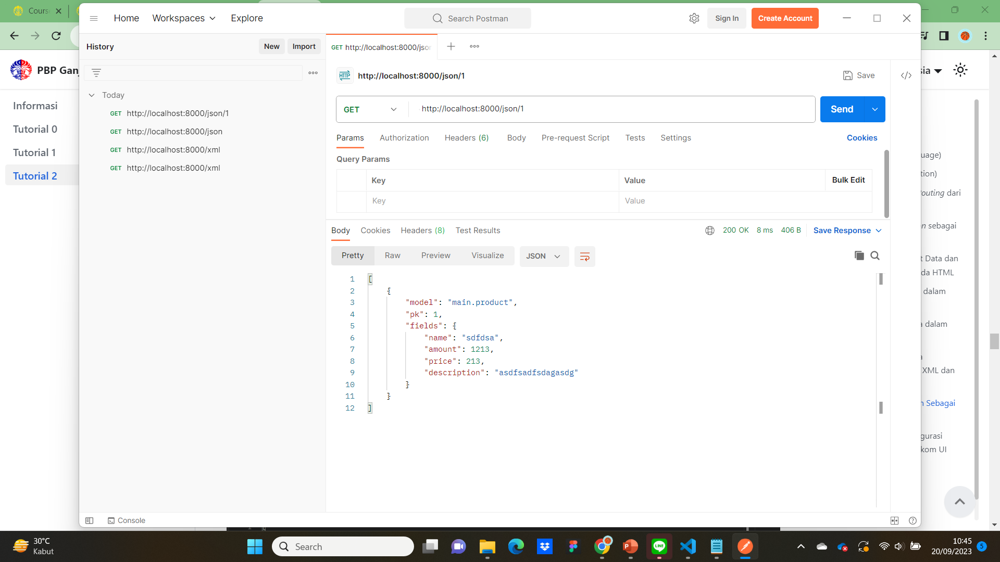

# Tugas 2
## 1. Jelaskan bagaimana cara kamu mengimplementasikan checklist di atas secara step-by-step (bukan hanya sekadar mengikuti tutorial).
### Membuat sebuah proyek Django baru.
pada direktori baru yang telah saya buat, saya membuat proyek Django baru "united_squad" dengan cara membuka terminal di direktori tersebut dan menulis kode ini.
~~~  
django-admin startproject united_squad
~~~  
### Membuat aplikasi dengan nama main pada proyek tersebut.
pada direktori proyek united_squad, saya membuat aplikasi main dengan menjalankan kode
~~~
python manage.py startapp main
~~~
### Melakukan routing pada proyek agar dapat menjalankan aplikasi main
setelah aplikasi ada, saya mendaftarkan aplikasi main ke dalam `settings.py`
~~~
INSTALLED_APPS = [
    'main',
    'django.contrib.admin',
    'django.contrib.auth',
    'django.contrib.contenttypes',
    'django.contrib.sessions',
    'django.contrib.messages',
    'django.contrib.staticfiles',
]
~~~
### Membuat model pada aplikasi `main` dengan nama `Product` dan memiliki atribut wajib sebagai berikut.
- `name` tipe `Charfield`
untuk nama dari model
- `amount` tipe `IntegerField`
untuk jumlah yang tesisa dari model
- `price` tipe `IntegerField`
untuk harga dari model
- `description` tipe `TextField`
untuk mendeskripsikan model

setelah itu saya akan migrasi untuk menyimpan model pada database
~~~
python manage.py makemigrations
python manage.py migrate
~~~
### Membuat sebuah fungsi `show_main` pada `views.py` untuk dikembalikan ke dalam sebuah template HTML
saya membuat fungsi `show_main` yang menyimpan data untuk `main.html`
~~~
from django.shortcuts import render

# Create your views here.
def show_main(request):
    context = {
        'name': 'Rayhan Dwi Sakha',
        'class': 'PBP E',
        'product': 'MANCHESTER UNITED LIFESTYLER THIRD JERSEY',
        'amount' : 25,
        'description' : "Taking Manchester United's beautiful game off the pitch. A super-wearable iteration of the club's third kit shirt, this lifestyler football jersey replaces performance features with premium engineered fabric that's soft to the touch and comfortable flat-knit details. The absence of a sponsor logo and that tonal adidas Badge of Sport ensure that all-important red devil crest takes even more of the spotlight. A minimum of 70% of this product is a blend of recycled and renewable materials.",
        'price' : 1400000
    }

    return render(request, "main.html", context)
~~~

### Membuat sebuah routing pada `urls.py` aplikasi `main` untuk memetakan fungsi yang telah dibuat pada `views.py`.
saya membuat routing untuk memetakan fungsi pada `views.py` dengan kode ini
~~~
from django.urls import path
from main.views import show_main

app_name = 'main'

urlpatterns = [
    path('', show_main, name='show_main'),
]
~~~

## 2. Buatlah bagan yang berisi request client ke web aplikasi berbasis Django beserta responnya dan jelaskan pada bagan tersebut kaitan antara urls.py, views.py, models.py, dan berkas html.

1. **urls.py**  
 Saat User melakukan pull request kepada website, request akan dikirim kepada fungsi yang sesuai pada halaman tersebut yang terdapat pada urlpatterns halaman tersebut. Pada halaman utama website ini, disambungkan dengan fungsi `show_main` yang berada pada `views.py`,
2. **views.py**
 Pada `views.py` terdapat fungsi `show_main` yang memiliki parameter `request` yang akan menerima request dari User. Pada fungsi tersebut, terdapat `context` yang merupakan dictionary untuk memberikan data pada `main.html` pada bagian return fungsi tersebut. Fungsi tersebut memilih `main.html` untuk mengirim data yang didapat dari database untuk ditampilkan nanti ke User.
3. **models.py**
 Semua bentuk model yang digunakan pada aplikasi dibuat dengan bentuk class pada file tersebut. Pada aplikasi main ini, dibuat sebuah model Product yang memiliki beberapa atribut. Pada `views.py`, dibuat berbagai object Product yang akan dikirim ke `main.html`.
4. **main.html**
  Data yang diterima dari `views.py` akan ditampilkan pada file html ini dan dapat dilihat oleh User.

## 3. Jelaskan mengapa kita menggunakan virtual environment? Apakah kita tetap dapat membuat aplikasi web berbasis Django tanpa menggunakan virtual environment?
dengan menggunakan virtual environment, kita dapat mengembangkan suatu proyek yang mungkin membutuhkan suatu versi terpisah tanpa mempengaruhi proyek lain atau instalasi python global. Hal ini juga bisa menghindari konflik dan keamanan proyek terjaga karena virtual environment bisa memisahkan kebutuhan proyek-proyek yang berbeda dengan mengisolasi dependensi spesifik yang dibutuhkan suatu proyek ke dalam lingkungan tersebut

Kita bisa membuat aplikasi web berbasis Django tanpa menggunakan  virtual environment. Tapi, seperti yang sudah dijelaskan sebelumnya. Jika kita tidak menggunaan virtual environment, maka akan menimbulkan risiko konflik dan masalah dependensi jika Anda bekerja pada lebih dari satu proyek atau ingin menggunakan dependensi spesifik.

## 4. Jelaskan apakah itu MVC, MVT, MVVM dan perbedaan dari ketiganya.
MVC, MVT, dan MVVM adalah pola desain yang digunakan dalam pengembangan perangkat lunak, khususnya dalam pengembangan aplikasi berbasis web dan mobile. Masing-masing pola ini memiliki tujuan dan konsep yang berbeda, meskipun mereka semua berusaha untuk memisahkan logika bisnis dari tampilan (UI) agar aplikasi lebih mudah dipahami, dikembangkan, dan dipelihara.

1. **MVC (Model-View-Controller)**:
   - **Model**: Menangani logika bisnis dan manipulasi data. Model ini mencakup pemodelan objek dan aturan bisnis aplikasi.
   - **View**: Bertanggung jawab untuk menampilkan data ke pengguna dan menerima masukan pengguna. Ini adalah bagian tampilan (UI) dari aplikasi.
   - **Controller**: Mengendalikan alur aplikasi dan menangani permintaan pengguna. Ini menghubungkan Model dan View, menerima masukan dari View, dan memutuskan tindakan apa yang harus diambil.

   Perbedaan utama MVC dengan MVT dan MVVM adalah bahwa MVC digunakan terutama dalam pengembangan perangkat lunak berbasis desktop dan aplikasi web tradisional. MVC biasanya digunakan dalam bahasa pemrograman seperti Java, C#, dan Ruby on Rails.

2. **MVT (Model-View-Template)**:
   - **Model**: Mirip dengan Model dalam MVC, menangani logika bisnis dan pemodelan data.
   - **View**: Menangani tampilan (UI) dan menampilkan data ke pengguna. Ini berfokus pada bagian tampilan aplikasi.
   - **Template**: Bertanggung jawab untuk tampilan halaman web dan bagaimana data disajikan dalam HTML. Template adalah bagian yang memisahkan tampilan dari logika aplikasi.

   MVT adalah pola desain yang umumnya digunakan dalam kerangka kerja web Django, yang menggunakan pendekatan yang lebih spesifik untuk pengembangan aplikasi web. Ini membedakan antara View dan Template, sehingga memudahkan pemisahan logika tampilan dan tampilan HTML.

3. **MVVM (Model-View-ViewModel)**:
   - **Model**: Mirip dengan Model dalam MVC dan MVT, menangani logika bisnis dan pemodelan data.
   - **View**: Bertanggung jawab untuk menampilkan data ke pengguna, tetapi dalam MVVM, View lebih pasif dan tidak memiliki logika bisnis yang signifikan.
   - **ViewModel**: Menyediakan lapisan abstraksi antara Model dan View. Ini mengubah data dari Model ke format yang dapat ditampilkan oleh View dan juga menangani interaksi pengguna dan perubahan data.

   MVVM adalah pola desain yang sering digunakan dalam pengembangan aplikasi berbasis mobile dengan kerangka kerja seperti Angular, Vue.js, dan beberapa platform mobile seperti Flutter.

Perbedaan utama antara ketiganya adalah dalam cara mereka mengatur dan mengelola tampilan (UI) dalam aplikasi. MVC lebih umum digunakan dalam pengembangan perangkat lunak desktop, MVT adalah pendekatan yang digunakan dalam kerangka kerja web Django, sedangkan MVVM adalah pendekatan yang umum digunakan dalam pengembangan aplikasi berbasis mobile.

# Tugas 3
## 1. Apa perbedaan antara form POST dan form GET dalam Django?
POST dan GET merupakan dua metode berbeda untuk mengirim sebuah data dari form HTML ke server
POST:
* data form dikirimkan sebagai bagian dari permintaan HTTP yang tidka terlihat user
* digunakan ketika ingin mengirim data yang mungkin akan memengaruhi server.
* gunakan metode ini jika ingin mengirim data yang sensitif
GET:
* data form ditambahkan ke URL sebagai parameter query string yang terlihat user
* digunakan ketika ingin mengambil atau mencari informasi dari server
* gunakan metode ini untuk operasi read-only atau ingin memungkinkan user dengan mudah membagikan hasilnya.

## 2. Apa perbedaan utama antara XML, JSON, dan HTML dalam konteks pengiriman data?
* XML dirancang untuk menyimapan dan mengirim data struktural. XML adalah format yang sangat fleksibel dan kuat untuk mendefinisikan struktur data yang kompleks. Biasanya digunakan dalam berbagai konteks, termasuk pertukaran data antara sistem yang berbeda, konfigurasi file, dan penyimpanan data
* JSON dirancang untuk pertukaran data ringan dan mudah dibaca antara aplikasi berbasis web. JSON dapat mewakili struktur data sederhana atau kompleks, tapi tidak sefleksibel XML dalam hal definisi struktur data. Digunakan dalamkonteks pertukaran data di web
* HTML dirancang untuk mendefinisikan struktur dan presentasi dokumen web. Karena fokus utamanya bukan data, HTML tidak sefleksibel dalam hal definisi struktur data seperti XML atau JSON. Digunakan untuk membaut halaman web yang dapat diakses oleh browser web. tidak umum digunakan untuk tujuan pertukuran data murni

## 3. Mengapa JSON sering digunakan dalam pertukaran data antara aplikasi web modern?
Seperti yang sudah dijelaskan sebelumnya. JSON (JavaScript Object Notation) memiliki format pertukaran data yang sangat ringan serta lebih mudah dibaca dan ditulis oleh manusia. JSON memiliki ukuran file yang lebih kecil dan transmisi data yang lebih cepat. JSON juga dapat diurai dengan fungsi JavaScript standar.

## 4. Jelaskan bagaimana cara kamu mengimplementasikan checklist di atas secara step-by-step.
### Membuat input form untuk menambahkan objek model pada app sebelumnya.
*Membuat `base.html` yang digunakan sebagai template untuk templates html yang ada
~~~

<!DOCTYPE html>
<html lang="en">
    <head>
        <meta charset="UTF-8" />
        <meta
            name="viewport"
            content="width=device-width, initial-scale=1.0"
        />
        
        
    </head>

    <body>
        
        
    </body>
</html>
~~~
*Mengedit `TEMPLATES` pada `settings.py` agar `base.html` terdeteksi
~~~
...
TEMPLATES = [
    {
        'BACKEND': 'django.template.backends.django.DjangoTemplates',
        'DIRS': [BASE_DIR / 'templates'],
        'APP_DIRS': True,
        ...
~~~
*mengedit `main.html` untuk meng-extend dari `base.html`
~~~

...
~~~
*membuat file `forms.py` untuk membuat form input dan mengimportnya ke file `views.py`
~~~
from django.forms import ModelForm
from main.models import Product

class ProductForm(ModelForm):
    class Meta:
        model = Product
        fields = ["name", "amount", "description", "price"]
~~~
properti dari form yang dibuat bia didapatkan dengan mengimport `ModelForm`. class `ProductForm` yang dibuat akan menginherit `ModelForm` dan memberikan properti `model` dan memanbahkan field pada properti model
*Membuat fungsi `create_product` untuk menambahkan data produk secara otomatis
~~~
def create_product(request):
    form = ProductForm(request.POST or None)

    if form.is_valid() and request.method == "POST":
        form.save()
        return HttpResponseRedirect(reverse('main:show_main'))

    context = {'form': form}
    return render(request, "create_product.html", context)
~~~
*Mengubah fungsi `show_main` supaya data bisa diakses pada `main.html`
~~~
def show_main(request):
    products = Product.objects.all()
    
    context = {
        'name': 'Rayhan Dwi Sakha',
        'class': 'PBP E',
        'product': products
    }

    return render(request, "main.html", context)
~~~
*Membuat `create_product.html` untuk menambahkan objek baru.
~~~
 


<h1>Add New Product</h1>

<form method="POST">
    
    <table>
        {{ form.as_table }}
        <tr>
            <td></td>
            <td>
                <input type="submit" value="Add Product"/>
            </td>
        </tr>
    </table>
</form>


~~~
### Tambahkan 5 fungsi views untuk melihat objek yang sudah ditambahkan dalam format HTML, XML, JSON, XML by ID, dan JSON by ID.
* fungsi `show_main` format HTML
~~~
def show_main(request):
    products = Product.objects.all()
    
    context = {
        'name': 'Rayhan Dwi Sakha',
        'class': 'PBP E',
        'product': products
    }

    return render(request, "main.html", context)
~~~
* fungsi `show_xml`
~~~
def show_xml(request):
    data = Product.objects.all()
    return HttpResponse(serializers.serialize("xml", data), content_type="application/xml")
~~~
* fungsi `show_json`
~~~
def show_json(request):
    data = Product.objects.all()
    return HttpResponse(serializers.serialize("json", data), content_type="application/json")
~~~
* fungsi `show_xml_by_id`
~~~
def show_xml_by_id(request, id):
    data = Product.objects.filter(pk=id)
    return HttpResponse(serializers.serialize("xml", data), content_type="application/xml")
~~~
* fungsi `show_json_by_id`
~~~
def show_json_by_id(request, id):
    data = Product.objects.filter(pk=id)
    return HttpResponse(serializers.serialize("json", data), content_type="application/json")
~~~

menambahkan url untuk kelima fungsi agar dapat diakses sesuai dengan url nya masing-masing
~~~
from django.urls import path
from main.views import show_main, create_product, show_xml, show_json, show_xml_by_id, show_json_by_id

app_name = 'main'

urlpatterns = [
    path('', show_main, name='show_main'),
    path('create-product', create_product, name='create_product'),
    path('xml/', show_xml, name='show_xml'),
    path('json/', show_json, name='show_json'), 
    path('xml/<int:id>/', show_xml_by_id, name='show_xml_by_id'),
path('json/<int:id>/', show_json_by_id, name='show_json_by_id'),
]
~~~
### Mengakses kelima URL di poin 2 menggunakan Postman, membuat screenshot dari hasil akses URL pada Postman, dan menambahkannya ke dalam README.md.
* HTML

* JSON

* XML

* JSON by id

* XML by id

